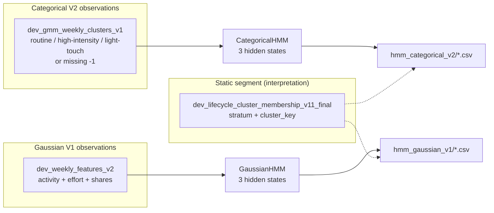

# HMM Experiment Guide: Categorical V2 vs Gaussian V1

This document is the **team-facing reference** for both weekly HMM experiments in this repo:

| Experiment | Notebook | Model | Observations |
|------------|----------|-------|----------------|
| **Categorical V2** | [`hmm_categorical_v2_from_gmm_weekly_gapaware_reproducible.ipynb`](hmm_categorical_v2_from_gmm_weekly_gapaware_reproducible.ipynb) | `hmmlearn.CategoricalHMM` | Weekly GMM cluster IDs + explicit missing-week category |
| **Gaussian V1** | [`hmm_gaussian_v1_weekly_gapaware_reproducible.ipynb`](hmm_gaussian_v1_weekly_gapaware_reproducible.ipynb) | `hmmlearn.GaussianHMM` | Continuous weekly behavior features (scaled) |

Related upstream / naming work:

- **V11 static segments:** `dev_lifecycle_cluster_membership_v11_final` (interpretation only, not HMM inputs)
- **Weekly GMM modes:** `dev_gmm_weekly_clusters_v1` (categorical HMM input; named in [Section 3.5](#35-weekly-gmm-cluster-names-official))
- **Weekly features:** `dev_weekly_features_v2` (Gaussian HMM input)

Shorter per-model guides still exist:

- [`README_hmm_categorical_v2_outputs.md`](README_hmm_categorical_v2_outputs.md)
- [`README_hmm_gaussian_v1_outputs.md`](README_hmm_gaussian_v1_outputs.md)

---

## 1. Why two HMMs?

Both models ask: **“What hidden weekly journey states best explain each developer’s timeline?”**  
They differ in what counts as an **observation** each week.



| Question | Prefer |
|----------|--------|
| Journey over **discrete weekly personas** (GMM modes)? | **Categorical V2** |
| Journey over **continuous intensity / build mix**? | **Gaussian V1** |
| One slide chain with clustering → GMM → HMM? | **Categorical V2** |
| Extra insight: steady weeks vs build-heavy spikes? | **Gaussian V1** (additive) |

**Do not compare BIC numbers across the two models.** They use different likelihoods, features, and (in this branch) different row counts after gap expansion and Gaussian lookback filtering.

For a **project-specific** comparison (NVIDIA developer lifecycle use cases, which model to lead with), see **[Section 7](#7-differences-and-when-to-use-each-model-nvidia-project)**.

---

## 2. Where outputs live

Notebooks write by default to:

- `outputs/hmm_categorical_v2/`
- `outputs/hmm_gaussian_v1/`

**Artifacts committed on this branch** (for review) are at repo root:

- [`hmm_categorical_v2/`](hmm_categorical_v2/) — 7 CSVs
- [`hmm_gaussian_v1/`](hmm_gaussian_v1/) — 8 CSVs

Re-running a notebook recreates the same filenames; copy or set `OUTPUT_DIR` if you want everything under `outputs/`.

---

## 3. Shared pipeline design

Both notebooks follow the same high-level recipe.

### 3.1 Inputs and filters

| Setting | Categorical V2 | Gaussian V1 |
|---------|----------------|-------------|
| Lifecycle filter | `active`, `cooling`, `at_risk` | Same |
| Min weeks per developer | `6` | `6` |
| Max developers sampled | `25,000` | `25,000` |
| Sampling order | `ORDER BY hash(developer_id \|\| SEED)` | Same (`SEED = 42`) |
| Hidden-state candidates | `2, 3, 4, 5` | `2, 3, 4, 5` |
| V11 usage | Join for `stratum`, `cluster_key`; **not** emission features | Same |

### 3.2 Gap-aware weekly timelines

For each sampled developer, the notebooks expand from **first observed week → last observed week** on a **Monday week grid** (`freq="W-MON"`).

- **Weeks with no row** in the source table → treated as **missing / no-activity** weeks.
- **Categorical:** `gmm_weekly_cluster_id` filled with **`-1`**, then remapped to a contiguous observation ID for `CategoricalHMM`.
- **Gaussian:** numeric features set to **0**; `has_activity_week = 0`.

This prevents the HMM from treating a 10-week silence as a single jump from week A → week B.

### 3.3 Model selection

- Fit each candidate `n_hidden_states` (and multiple random seeds for Gaussian).
- Record **log-likelihood**, **AIC**, **BIC**.
- **Lower BIC is better** within the same experiment and same data.
- **Gaussian only:** drop candidates where any hidden state holds **< 1%** of rows (`min_state_share >= 0.01`) before picking the winner. That rejected 4- and 5-state models with ~0.3% “micro-states” despite slightly lower BIC.

### 3.4 Decoding and exports

1. Pick best model → `predict` hidden state per developer-week.
2. Build emission summaries, transition matrix, state volumes.
3. Join decoded states to V11 → breakdowns by `stratum` and `cluster_key`.
4. Export CSV summaries (no DuckDB assignment tables in v1).

---

## 3.5 Weekly GMM cluster names (official)

These names come from [`gmm_weekly_cluster_profiling.ipynb`](gmm_weekly_cluster_profiling.ipynb) (joined `dev_gmm_weekly_clusters_v1` × `dev_weekly_features_v2`). Use them anywhere the repo refers to **GMM 0 / 1 / 2**. They are **not** HMM hidden states.

**Label convention in this doc:** tables use **Display Name (id)** — e.g. **Routine week (0)**, **Missing Dominant (2)** — so numeric IDs from CSVs stay traceable.

| ID | Official name | Slide label | One-line description |
|----|---------------|-------------|----------------------|
| **Routine week (0)** | **`routine_engagement_week`** | Routine week | The **default engaged week**: moderate activity (~4.4 events/week), some build signal (~2.5 builds/week). Most common GMM mode in the population. |
| **High-intensity week (1)** | **`high_intensity_week`** | High-intensity week | A **rare power-user week**: very high activity (~34 events/week) and builds (~26/week). Deep, heavy platform use. |
| **Light-touch week (2)** | **`light_touch_week`** | Light-touch week | A **low-depth week**: lowest typical activity (~3.1 events/week), minimal builds (~0.7/week). Still on-platform, but shallow engagement. |

**Fourth observed category (categorical HMM only):**

| ID | Name | Slide label | Description |
|----|------|-------------|-------------|
| **Missing week (-1)** | **`missing_no_activity_week`** | Missing week | Gap-filled calendar week with **no row** in the GMM table between the developer’s first and last observed week. Not a GMM cluster—explicit silence / no observed weekly assignment. |

**Profiling snapshot (full population, observed GMM weeks only):**

| ID | `n_weeks` | `avg_activity_count` | `avg_build_count` | Notes |
|----|-----------|----------------------|-------------------|--------|
| Routine week (0) | ~8.99M | 4.36 | 2.48 | Modal week type |
| High-intensity week (1) | ~383k | 33.76 | 26.48 | Rare spikes |
| Light-touch week (2) | ~5.53M | 3.12 | 0.72 | Light engagement |

`pct_zero_activity_weeks ≈ 0` for IDs 0–2 because those rows exist in the GMM table; true zero-activity silence is modeled as **`-1`** in the categorical HMM after gap expansion.

**CSV reference:** [`outputs/gmm_weekly_cluster_profiling/gmm_weekly_cluster_name_suggestions.csv`](outputs/gmm_weekly_cluster_profiling/gmm_weekly_cluster_name_suggestions.csv) (update `provisional_name` column to match this table when re-exporting).

---

## 4. Categorical HMM V2 (full breakdown)

### 4.1 Notebook

[`hmm_categorical_v2_from_gmm_weekly_gapaware_reproducible.ipynb`](hmm_categorical_v2_from_gmm_weekly_gapaware_reproducible.ipynb)

**Dependencies:** [`requirements_hmm_categorical_v1.txt`](requirements_hmm_categorical_v1.txt) (`hmmlearn`, `duckdb`, `pandas`, etc.)

### 4.2 Required data

| Source | Table / file | Role |
|--------|----------------|------|
| Weekly GMM | `dev_gmm_weekly_clusters_v1` | Observed category each week (`gmm_weekly_cluster_id`, posteriors) |
| V11 final | `dev_lifecycle_cluster_membership_v11_final` | Static segment for interpretation |
| Optional | `developer_project.duckdb` | Auto-load; else parquets in `PROJECT_DIR` |

**V2-specific behavior (vs v1):**

- **No drop** of low-posterior GMM weeks (`MIN_GMM_POSTERIOR = 0.50` is metadata only).
- **Explicit missing category** `-1` after gap fill.
- **Reproducible** `hash(developer_id || SEED)` sampling (not `random()`).

### 4.3 Observed categories (4 emissions)

After gap fill and remapping for `CategoricalHMM`:

| Remapped obs ID | Original `gmm_weekly_cluster_id` | Official name |
|-----------------|-------------------------------------|---------------|
| `gmm_obs_0_orig_-1` | Missing week (-1) | `missing_no_activity_week` |
| `gmm_obs_1_orig_0` | Routine week (0) | `routine_engagement_week` |
| `gmm_obs_2_orig_1` | High-intensity week (1) | `high_intensity_week` |
| `gmm_obs_3_orig_2` | Light-touch week (2) | `light_touch_week` |

See [Section 3.5](#35-weekly-gmm-cluster-names-official) for definitions and profiling stats.

### 4.4 Model selection (this branch’s run)

From [`hmm_categorical_v2/hmm_categorical_model_comparison.csv`](hmm_categorical_v2/hmm_categorical_model_comparison.csv):

| `n_hidden_states` | BIC | Selected? |
|-------------------|-----|-----------|
| **3** | **2,186,289** | **Yes (lowest)** |
| 5 | 2,187,244 | No |
| 4 | 2,193,307 | No |
| 2 | 2,248,688 | No |

- **Sequences:** 25,000 developers  
- **Weekly rows (gap-expanded):** 3,688,458  
- **Observed categories:** 4  
- **Converged:** yes (`n_iter` = 100)

### 4.5 Hidden states (this run) — provisional names

From emissions in [`hmm_categorical_emission_probabilities.csv`](hmm_categorical_v2/hmm_categorical_emission_probabilities.csv):

| HMM state | % of all weeks | Provisional name | Emission signature (using GMM names) |
|-----------|----------------|------------------|--------------------------------------|
| **Missing Dominant (2)** | **91.1%** | `missing_dominant` | 96.6% **Missing week (-1)**; 3.1% **Routine week (0)** |
| **Low Mixed Engagement (0)** | 7.2% | `low_mixed_engagement` | 53.7% **Routine week (0)**; 39.8% **Missing week (-1)**; rare **High-intensity week (1)** / **Light-touch week (2)** |
| **Active Observed Engagement (1)** | 1.7% | `active_observed_engagement` | 0.3% **Missing week (-1)**; 55.8% **Routine week (0)**; **38.4% Light-touch week (2)**; 5.5% **High-intensity week (1)** |

**Transitions (one-week ahead):**

| From → To | Low Mixed Engagement (0) | Active Observed Engagement (1) | Missing Dominant (2) |
|-----------|--------------------------|--------------------------------|----------------------|
| **Low Mixed Engagement (0)** | 0.87 | 0.12 | 0.01 |
| **Active Observed Engagement (1)** | 0.27 | 0.19 | 0.53 |
| **Missing Dominant (2)** | 0.006 | 0.006 | **0.99** |

Missing Dominant (2) is extremely sticky (98.8% stay). Active Observed Engagement (1) often returns to Missing Dominant (2) (53%) — consistent with rare “active spell” weeks surrounded by missing-dominated periods.

**By lifecycle stratum (% of weeks in each hidden state):**

| Stratum | Low Mixed Engagement (0) | Active Observed Engagement (1) | Missing Dominant (2) |
|---------|--------------------------|--------------------------------|----------------------|
| active | 18.2% | 2.5% | **79.3%** |
| cooling | 6.2% | 1.6% | **92.2%** |
| at_risk | 4.4% | 1.5% | **94.1%** |

Active developers show the most **low/mixed** and **active_observed** signal; all strata are still dominated by the missing-dominated hidden state because of gap-filled weeks.

### 4.6 Output files (categorical)

#### `hmm_categorical_model_comparison.csv`

**How produced:** Grid over `N_HIDDEN_STATE_OPTIONS`; one row per candidate state count after fit.

| Column | Meaning |
|--------|---------|
| `n_hidden_states` | Candidate hidden state count |
| `log_likelihood` | Maximized log-likelihood |
| `aic`, `bic` | Information criteria (**lower BIC = better**) |
| `n_obs` | Total developer-week rows in fit |
| `n_sequences` | Number of developers (sequences) |
| `n_observed_gmm_clusters` | Count of observation categories (4) |
| `converged`, `n_iter` | EM convergence |

#### `hmm_categorical_emission_probabilities.csv`

**How produced:** `best_model.emissionprob_` after selecting best BIC model.

| Structure | Meaning |
|-----------|---------|
| Rows | Hidden HMM states (`hmm_state_0`, …) |
| Columns | Observed categories (`gmm_obs_*_orig_*`) |
| Values | **P(observed category \| hidden state)** |

**Primary artifact for naming hidden states.**

#### `hmm_categorical_state_profiles.csv`

**How produced:** `groupby("hmm_state")` on decoded `hmm_df`.

| Column | Meaning |
|--------|---------|
| `n_weekly_rows` | Weeks assigned to this hidden state |
| `n_developers` | Distinct developers with ≥1 week in state |
| `avg_gmm_posterior` | Mean GMM max posterior on those weeks |
| `most_common_gmm_cluster` | Mode of raw `gmm_weekly_cluster_id` (-1 = missing) |
| `stratum_mode` | Most common V11 stratum among rows in state |
| `share_of_rows` | Fraction of all decoded weeks |

#### `hmm_categorical_transition_matrix.csv`

**How produced:** `best_model.transmat_` (square, rows = from, cols = to).

#### `hmm_categorical_transition_matrix_long.csv`

**How produced:** Melt of transition matrix → `from_state`, `to_state`, `transition_probability` for plots.

#### `hmm_categorical_state_by_stratum.csv`

**How produced:** Count decoded weeks by `(stratum, hmm_state)`; `share_within_stratum` = fraction inside each stratum.

#### `hmm_categorical_state_by_v11_cluster.csv`

**How produced:** Same by `(stratum, cluster_key, hmm_state)`; `share_within_cluster` for cluster-specific journey mix.

**Typical use:** See whether e.g. `active_3` spends more time in Active Observed Engagement (1) vs noise clusters that are mostly Missing Dominant (2).

---

## 5. Gaussian HMM V1 (full breakdown)

### 5.1 Notebook

[`hmm_gaussian_v1_weekly_gapaware_reproducible.ipynb`](hmm_gaussian_v1_weekly_gapaware_reproducible.ipynb)

**Dependencies:** [`requirements_hmm_gaussian_v1.txt`](requirements_hmm_gaussian_v1.txt)

### 5.2 Required data

| Source | Table / file | Role |
|--------|----------------|------|
| Weekly features | `dev_weekly_features_v2` | Continuous observations |
| V11 final | `dev_lifecycle_cluster_membership_v11_final` | Interpretation |
| **Not used** | `dev_gmm_weekly_clusters_v1` | Categorical path only |

**Gaussian-specific settings:**

- `MAX_WEEKS_LOOKBACK = 104` (only last ~2 years of weeks in SQL join)
- `RESTART_SEEDS = [42, 52, 62]` (multiple EM inits per state count)
- Features **standardized** with `sklearn.preprocessing.StandardScaler` before fit
- Gap weeks: features → 0, `has_activity_week = 0`

### 5.3 Feature vector (11 dimensions)

Built per week on gap-expanded data:

| Feature | Description |
|---------|-------------|
| `log_activity_count` | `log1p(activity_count_total)` |
| `log_activity_score_sum` | `log1p(activity_score_sum)` |
| `unique_activity_types` | Count of distinct activity types |
| `build_share` | `build_count / activity_count_total` (0 if no activity) |
| `high_effort_share` | `high_effort_count / activity_count_total` |
| `product_use_share` | `product_use_count / activity_count_total` |
| `has_activity_week` | 1 if any activity, else 0 (flags gap weeks) |

Raw counts (`build_count`, etc.) are used for **raw emission profiles** after decode, not necessarily all in the scaled fit matrix (see notebook `feature_cols`).

### 5.4 Model selection (this branch’s run)

From [`hmm_gaussian_v1/hmm_gaussian_model_comparison.csv`](hmm_gaussian_v1/hmm_gaussian_model_comparison.csv):

| `n_hidden_states` | Best BIC | `min_state_share` | Selected? |
|-------------------|----------|-------------------|-----------|
| 2 | −9.23×10⁷ | 27.8% | No (worse than 3) |
| **3** | **−9.58×10⁷** | **9.1%** | **Yes** |
| 4 | −1.04×10⁸ | 0.33% | No (tiny state) |
| 5 | −1.06×10⁸ | 0.33% | No (tiny state) |

**Why BIC looks “huge”:** With ~1M+ observations, both the likelihood term and `k·ln(n)` are large. **Only relative BIC within this table matters**, not the absolute scale. **Do not compare** to categorical BIC (~10⁶).

- **Weekly rows (gap-expanded):** 1,079,360 (smaller than categorical due to **104-week lookback** on features)
- **Converged:** yes (11 iterations for 3-state model)

### 5.5 Hidden states (this run) — provisional names

From [`hmm_gaussian_emission_profiles_raw.csv`](hmm_gaussian_v1/hmm_gaussian_emission_profiles_raw.csv) and [`hmm_gaussian_state_profiles.csv`](hmm_gaussian_v1/hmm_gaussian_state_profiles.csv):

| HMM state | % of weeks | Provisional name | Signature |
|-----------|------------|------------------|-------------|
| **Inactive Gap Week (0)** | **72.2%** | `inactive_gap_week` | 100% missing weeks; all features ≈ 0; `has_activity_week = 0` |
| **Steady Engagement Week (1)** | 18.7% | `steady_engagement_week` | Real activity; ~7.1 activities/week; moderate logs; low build share |
| **Build Intensity Spike Week (2)** | 9.1% | `build_intensity_spike_week` | Real activity; ~13.5 activities/week; **~86% build_share** |

**Z-space highlights** ([`hmm_gaussian_emission_profiles_z.csv`](hmm_gaussian_v1/hmm_gaussian_emission_profiles_z.csv)):

- Steady Engagement Week (1): elevated `has_activity_week`, activity logs, diversity (+1.2 to +1.6σ)
- Build Intensity Spike Week (2): very high `build_share` (+3.05σ), high activity score (+2.33σ)

**Transitions:**

| From → To | Inactive Gap Week (0) | Steady Engagement Week (1) | Build Intensity Spike Week (2) |
|-----------|-----------------------|----------------------------|--------------------------------|
| **Inactive Gap Week (0)** | **0.86** | 0.08 | 0.06 |
| **Steady Engagement Week (1)** | 0.32 | **0.64** | 0.04 |
| **Build Intensity Spike Week (2)** | **0.51** | 0.09 | 0.40 |

Inactive Gap Week (0) weeks are sticky. Build Intensity Spike Week (2) weeks often revert to Inactive Gap Week (0) (51%) rather than staying in build (40%). Steady Engagement Week (1) weeks often lapse to inactive (32%).

**By lifecycle stratum:**

| Stratum | Inactive Gap Week (0) | Steady Engagement Week (1) | Build Intensity Spike Week (2) |
|---------|-----------------------|----------------------------|--------------------------------|
| active | 61.3% | **29.3%** | 9.5% |
| cooling | 80.2% | 11.4% | 8.3% |
| at_risk | 77.1% | 13.8% | 9.1% |

Gaussian assigns **more mass to non-gap dynamics** than categorical (29% steady in active vs 2.5% “active_observed”).

### 5.6 Output files (Gaussian)

#### `hmm_gaussian_model_comparison.csv`

**How produced:** Loop over `N_HIDDEN_STATE_OPTIONS` × `RESTART_SEEDS`; compute AIC/BIC from log-likelihood and parameter count.

| Column | Meaning |
|--------|---------|
| `n_hidden_states`, `seed` | Candidate size and random init |
| `loglik`, `aic`, `bic` | Fit quality (**lower BIC better**) |
| `converged`, `n_iter` | EM status |
| `min_state_share` | Smallest fraction of weeks in any one hidden state |
| `n_active_states` | States with non-negligible mass |

#### `hmm_gaussian_emission_profiles_z.csv`

**How produced:** Mean **scaled** feature vector per decoded `hmm_state`.

Use for **relative** comparison (which features distinguish states).

#### `hmm_gaussian_emission_profiles_raw.csv`

**How produced:** Mean **unscaled** `feature_cols` per `hmm_state` on `hmm_df`.

Use for **business-readable** magnitudes (activities/week, shares).

#### `hmm_gaussian_state_profiles.csv`

| Column | Meaning |
|--------|---------|
| `n_weekly_rows`, `n_developers` | Volume |
| `share_missing_weeks` | Mean `missing_week_flag` |
| `avg_activity_count` | Mean raw activity (NaN if all missing) |
| `stratum_mode` | Dominant V11 stratum |
| `share_of_rows` | Global week fraction |

#### `hmm_gaussian_transition_matrix.csv` / `hmm_gaussian_transition_matrix_long.csv`

Same role as categorical (from `best_model.transmat_`).

#### `hmm_gaussian_state_by_stratum.csv` / `hmm_gaussian_state_by_v11_cluster.csv`

Same role as categorical, for Gaussian decoded states.

---

## 6. Side-by-side comparison (same branch runs)

| Dimension | Categorical V2 | Gaussian V1 |
|-----------|----------------|-------------|
| **Weekly input** | GMM cluster ID (+ missing) | Continuous features |
| **Gap handling** | Missing week (-1) | Zeros + `has_activity_week=0` |
| **Rows in fit** | 3,688,458 | 1,079,360 |
| **Lookback** | Full span per dev (in sample) | Last 104 weeks |
| **Selected K** | 3 | 3 |
| **Dominant hidden state** | 91% Missing Dominant (2) | 72% Inactive Gap Week (0) |
| **Rare “active” signal** | 1.7% Active Observed Engagement (1) | 18.7% Steady Engagement Week (1) + 9.1% Build Intensity Spike Week (2) |
| **Distinctive extra signal** | **Light-touch week (2)** in Active Observed Engagement (1) | Build-share spike in Build Intensity Spike Week (2) |
| **BIC magnitude** | ~10⁶ | ~10⁷ (negative; not comparable) |

**Complementary, not redundant:** Categorical explains journeys over **GMM personas**; Gaussian explains **intensity shape** (especially build-heavy weeks) without discretizing through GMM first.

---

## 7. Differences and when to use each model (NVIDIA project)

This section ties the two HMMs to the **NVIDIA Industry Project** goal: understand **developer lifecycle** (`active`, `cooling`, `at_risk`) and **weekly behavior** over time, on top of the static V11 HDBSCAN segments—not to replace V11, but to add a **temporal journey** layer for storytelling, exploration, and (eventually) program design.

### 7.1 What problem each model solves

| Lens | Categorical V2 | Gaussian V1 |
|------|----------------|-------------|
| **Question** | “How does this developer move between **weekly behavior modes** (GMM) and **silent weeks**?” | “How does this developer move between **intensity regimes** (steady activity vs build-heavy vs inactive)?” |
| **Observation** | Discrete: Missing week (-1), Routine week (0), High-intensity week (1), Light-touch week (2) | Continuous: logs, counts, effort/build/product **shares** |
| **Depends on** | Upstream **weekly GMM** (`dev_gmm_weekly_clusters_v1`) | Upstream **feature table** (`dev_weekly_features_v2`) only |
| **Best aligns with** | Existing pipeline: lifecycle clustering → weekly GMM → HMM | Feature science: “what drives at_risk?” without re-bucketing through GMM |
| **Stakeholder language** | “They were in a **light/moderate/high** week, then went quiet” | “They had **steady** weeks, then a **build spike**, then dropped off” |

Both join back to **V11** (`stratum`, `cluster_key`) for interpretation. Neither re-trains HDBSCAN; both describe **dynamics within** a segment.

### 7.2 Technical differences that matter for this repo

| Topic | Categorical V2 | Gaussian V1 |
|-------|----------------|-------------|
| **Information loss** | Collapses each week to one of 4 symbols (3 GMM + missing) | Keeps graded signal (e.g. build_share ~86% vs ~0%) |
| **GMM quality** | Errors/noise in GMM assignments **propagate** into HMM | Bypasses GMM; sensitive to feature scaling and zeros on gap weeks |
| **Gap weeks** | Missing week (-1) (clean for “went quiet”) | Zeros + `has_activity_week=0` (Inactive Gap Week (0) absorbs gaps) |
| **Sample in our runs** | ~3.7M developer-weeks, full span per dev in sample | ~1.1M weeks, **last 104 weeks** only |
| **Rare “active” dynamics** | Only ~1.7% of weeks in Active Observed Engagement (1) | ~28% of weeks in Steady Engagement Week (1) + Build Intensity Spike Week (2) |
| **Model pick** | Lowest BIC among 2–5 states | Lowest BIC among 2–5 **with** ≥1% mass per state |
| **Operational cost** | Must maintain GMM weekly table + mapping | Only weekly features + V11 join |

**Implication for NVIDIA:** Categorical is the **integration-friendly** choice (same story as clustering + GMM slides). Gaussian is the **sensitivity analysis** choice when you care about **build vs product-use mix** that GMM IDs might blur.

### 7.3 Where categorical V2 is more beneficial

Use **categorical V2 as the primary HMM** when the audience is NVIDIA partners, PMs, or academic reviewers who already follow your stack:

1. **End-to-end narrative (recommended for final presentation)**  
   Static segment (V11) → weekly persona (GMM) → journey (categorical HMM). One coherent arc without introducing a parallel feature-space model.

2. **Playbooks tied to named weekly modes**  
   Use the official GMM names (**routine**, **high-intensity**, **light-touch**, **missing**). Example: “mostly **routine** weeks with gaps” vs “when they are active, often **light-touch**” (matches Active Observed Engagement (1) emissions).

3. **Comparing journeys across lifecycle strata**  
   Your run shows **active** developers with more **low/mixed** hidden-state weeks (18%) vs **at_risk/cooling** (mostly missing-dominated). That supports lifecycle storytelling: *active accounts still show more “observed engagement” mix in the categorical lens*.

4. **Linking to V11 clusters**  
   When you need “does `active_3` behave differently from `active_noise` over **weeks**?”—categorical emissions reference the same GMM buckets you already cluster on.

5. **Stable discrete outputs for future tooling**  
   Hidden state + observed GMM category are **small integers**—easier for DuckDB rules, dashboards, or rule-based alerts than 11-dimensional Gaussian posteriors.

**Categorical is weaker when:** you need fine distinction between “high activity with builds” vs “high activity without builds”—Active Observed Engagement (1) mixes **Routine week (0)** and **Light-touch week (2)**; Gaussian separates that via `build_share`. Rare **High-intensity week (1)** weeks are a separate GMM bucket but uncommon in HMM emissions.

### 7.4 Where Gaussian V1 is more beneficial

Use **Gaussian V1 as the secondary / deep-dive HMM** when the question is about **how much** and **what kind** of activity, not which GMM bucket:

1. **Build- and effort-shaped programs**  
   Build Intensity Spike Week (2) in our run is a **build-intensity spike** week (~86% build share). That is directly relevant to NVIDIA narratives around **compilation/build workflows**, SDK adoption, and deep technical engagement—without re-deriving labels from GMM.

2. **Engagement intensity for active vs at_risk**  
   Among **active** developers, Gaussian assigns ~29% of weeks to **steady engagement** vs ~10% build-spike; cooling/at_risk are more inactive. Useful for questions like: *“Are at_risk developers only quiet, or do they still show burst weeks?”* (see build state ~9% even in at_risk).

3. **Feature experiments without retraining GMM**  
   If the team adds new weekly signals to `dev_weekly_features_v2` (e.g. new product-use flags), Gaussian HMM can be re-fit **without** rebuilding `dev_gmm_weekly_clusters_v1`.

4. **Richer “return to silence” dynamics**  
   Transitions from build-spike → inactive (51%) vs steady → inactive (32%) support hypotheses about **post-sprint drop-off** vs gradual cooling—harder to see when almost everything collapses to a single “missing” categorical hidden state.

5. **Internal data science validation**  
   Check whether GMM modes align with continuous regimes. If Gaussian “steady” and “build” weeks map cleanly onto **routine / high-intensity / light-touch**, GMM is validated; if not, that is a finding for NVIDIA about **discretization risk**.

**Gaussian is weaker when:** you need a single slide tied to GMM cluster IDs, or when gap weeks dominate and you want a **dedicated missing symbol** (categorical’s 97% missing emission in Missing Dominant (2) is more explicit than Gaussian’s zero-vector inactive state).

### 7.5 Recommended split for this project (practical default)

```text
PRIMARY (external / deck):     Categorical V2 on GMM weekly modes
SUPPORTING (appendix / tech):  Gaussian V1 on dev_weekly_features_v2
ANCHOR (static):               V11 lifecycle + cluster_key
NAMING (upstream):             gmm_weekly_cluster_profiling.ipynb
```

| NVIDIA-facing goal | Lead with | Why |
|--------------------|-----------|-----|
| Explain methodology end-to-end | **Categorical** | Matches V11 → GMM → HMM pipeline |
| Describe “week types” (routine / light-touch / high-intensity) | **Categorical** + [Section 3.5](#35-weekly-gmm-cluster-names-official) | Shared vocabulary |
| Highlight **build-heavy** engagement weeks | **Gaussian** | `build_share` spike state |
| Compare **active vs cooling vs at_risk** journeys | **Both** (stratum CSVs) | Categorical: mode mix; Gaussian: intensity mix |
| Prioritize outreach to “still bursts then goes quiet” devs | **Gaussian** transitions | Build → inactive path |
| Dashboard / rules with simple enums | **Categorical** | Small state + category space |
| Avoid maintaining two production models | **Categorical only** for v1 ship; Gaussian as research | Lowest integration burden |

### 7.6 Use-case sketches (lifecycle strata)

These are **interpretation patterns** from our branch runs—not prescriptive NVIDIA policies.

**Active stratum**

- *Categorical:* Still ~79% Missing Dominant (2) weeks (gap-filled timelines), but highest share of **Low Mixed Engagement (0)** and **Active Observed Engagement (1)** vs other strata.  
- *Gaussian:* ~29% **Steady Engagement Week (1)** + ~10% **Build Intensity Spike Week (2)**—best place to discuss healthy ongoing engagement.  
- **Benefit:** Gaussian for “how intense”; categorical for “which GMM persona when they do show up.”

**Cooling stratum**

- *Categorical:* ~92% Missing Dominant (2); little Active Observed Engagement (1).  
- *Gaussian:* ~80% Inactive Gap Week (0), lower Steady Engagement Week (1) share than active.  
- **Benefit:** Both support “cooling = mostly quiet weeks”; Gaussian adds whether **any** build spikes remain (re-engagement hook).

**At_risk stratum**

- *Categorical:* ~94% Missing Dominant (2); rare Active Observed Engagement (1).  
- *Gaussian:* ~77% Inactive Gap Week (0) but non-trivial Steady Engagement Week (1) + Build Intensity Spike Week (2) (~23% combined).  
- **Benefit:** Gaussian can flag **residual activity** that categorical buries in rare states; categorical makes **silence** explicit in emissions.

### 7.7 What we should not claim to NVIDIA

- **Do not** say one HMM is “more accurate” from BIC alone (different likelihoods and sample sizes).  
- **Do not** treat HMM hidden states as new official segments—they are **weekly journey modes**, orthogonal to V11 membership.  
- **Do not** ignore gap-fill: any “% time in state X” should note that long calendar gaps inflate inactive/missing states unless you filter to observed activity weeks.  
- **Do not** merge categorical and Gaussian state IDs—they are different label spaces (Active Observed Engagement (1) ≠ Steady Engagement Week (1)).

### 7.8 Suggested one-liner for stakeholders

> **V11 tells us who the developer is; weekly GMM tells us what kind of week they had (routine, light-touch, high-intensity, or missing); categorical HMM tells us how those week-types evolve—including silence; Gaussian HMM adds how intense and build-heavy those active weeks are. We lead with categorical for the story, and use Gaussian to validate and sharpen build-centric insights.**

---

## 8. Recommended reading order

### Categorical V2

1. `hmm_categorical_model_comparison.csv` — justify K=3  
2. `hmm_categorical_emission_probabilities.csv` — name states  
3. `hmm_categorical_state_profiles.csv` — volumes  
4. `hmm_categorical_transition_matrix.csv` — dynamics  
5. `hmm_categorical_state_by_stratum.csv` — vs lifecycle  
6. `hmm_categorical_state_by_v11_cluster.csv` — vs HDBSCAN segments  

### Gaussian V1

1. `hmm_gaussian_model_comparison.csv` — justify K=3 (with guardrail note)  
2. `hmm_gaussian_emission_profiles_raw.csv` — name states  
3. `hmm_gaussian_emission_profiles_z.csv` — feature emphasis  
4. `hmm_gaussian_state_profiles.csv` — volumes  
5. `hmm_gaussian_transition_matrix.csv` — dynamics  
6. `hmm_gaussian_state_by_stratum.csv` — vs lifecycle  
7. `hmm_gaussian_state_by_v11_cluster.csv` — vs HDBSCAN segments  

---

## 9. How to reproduce

### Local

```bash
pip install -r requirements_hmm_categorical_v1.txt   # or requirements_hmm_gaussian_v1.txt
```

1. Ensure `developer_project.duckdb` (or parquets) in `PROJECT_DIR`.  
2. Run notebooks top-to-bottom.  
3. Outputs appear under `OUTPUT_DIR` in each notebook (default `outputs/hmm_*`).

### Colab

```python
# from google.colab import drive
# drive.mount("/content/drive")
PROJECT_DIR = "/content/drive/MyDrive/NVIDIA Industry Project"
```

Upload at minimum:

- **Categorical:** `dev_gmm_weekly_clusters_v1.parquet`, `dev_lifecycle_cluster_membership_v11_final.parquet`  
- **Gaussian:** `dev_weekly_features_v2.parquet`, `dev_lifecycle_cluster_membership_v11_final.parquet`

---

## 10. Caveats and limitations

1. **Exploratory CSV workflow** — no production DuckDB tables of per-week HMM assignments yet.  
2. **Gap-fill dominates** both models — any stratum/cluster view should note missing-week inflation; consider filtering to `has_activity_week = 1` (Gaussian) or `gmm_weekly_cluster_id != -1` (categorical) for “active journey only” views.  
3. **GMM cluster names** (Section 3.5) are set from profiling; **HMM hidden-state names** remain provisional working labels.  
4. **Sampled 25k developers** — not full population; reproducible but not exhaustive.  
5. **Gaussian 104-week window** — not the same temporal support as categorical; align windows before claiming one model “fits better.”  
6. **V11 is not causal input** — joining HMM states to `cluster_key` is descriptive overlap, not proof HMM rediscovers HDBSCAN.  
7. **Hidden-state names** in this doc are working labels — update after stakeholder review.

---

## 11. Suggested deck narrative

1. **V11** = who the developer is (static lifecycle segment).  
2. **GMM weekly** = what kind of week they had (**routine**, **light-touch**, **high-intensity**; or **missing** after gap-fill).  
3. **Categorical HMM** = how those week-types evolve (including long inactive gaps).  
4. **Gaussian HMM** = same timeline, but highlights **steady** vs **build-heavy** continuous behavior.  
5. **Joint insight:** Active stratum shows more steady/build signal in Gaussian space and more low/mixed GMM signal in categorical space; both agree timelines are mostly inactive/gap-dominated.

---

## 12. File inventory (quick reference)

### `hmm_categorical_v2/`

| File | Purpose |
|------|---------|
| `hmm_categorical_model_comparison.csv` | Pick number of hidden states |
| `hmm_categorical_emission_probabilities.csv` | P(obs \| hidden state) |
| `hmm_categorical_state_profiles.csv` | Volume / GMM mode summary per state |
| `hmm_categorical_transition_matrix.csv` | Transition probabilities (wide) |
| `hmm_categorical_transition_matrix_long.csv` | Transitions (long) |
| `hmm_categorical_state_by_stratum.csv` | State mix by lifecycle stratum |
| `hmm_categorical_state_by_v11_cluster.csv` | State mix by V11 cluster |

### `hmm_gaussian_v1/`

| File | Purpose |
|------|---------|
| `hmm_gaussian_model_comparison.csv` | Pick K (+ seeds); BIC guardrail |
| `hmm_gaussian_emission_profiles_z.csv` | Mean scaled features per state |
| `hmm_gaussian_emission_profiles_raw.csv` | Mean raw features per state |
| `hmm_gaussian_state_profiles.csv` | Volume / missing share per state |
| `hmm_gaussian_transition_matrix.csv` | Transition probabilities (wide) |
| `hmm_gaussian_transition_matrix_long.csv` | Transitions (long) |
| `hmm_gaussian_state_by_stratum.csv` | State mix by lifecycle stratum |
| `hmm_gaussian_state_by_v11_cluster.csv` | State mix by V11 cluster |

---

*Generated for branch documentation. Numbers reflect artifacts in `hmm_categorical_v2/` and `hmm_gaussian_v1/` at commit time.*
